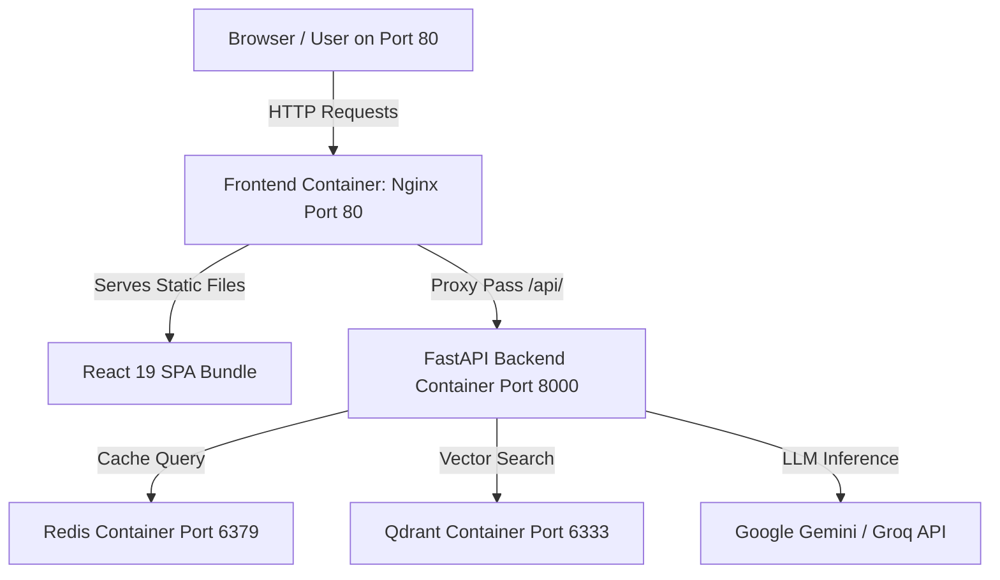

# 📄 Document Summarizer Deployment & Debugging Case Study

> [!NOTE]  
> **Project Context**: AI-Powered Document Summarizer & RAG Chat Application deployed on AWS EC2 (`t3.micro`) using Docker Compose.

---

## 1. System Architecture Overview



### Technology Stack
* **Frontend**: React 19, Vite 8, TypeScript, Tailwind CSS, Nginx
* **Backend**: FastAPI (Python 3.10+)
* **Database & Cache**: Redis 7 (Summary Cache), Qdrant (Vector DB for RAG Document Chat)
* **AI Engines**: Google Gemini 2.0 Flash, Groq API, PyTorch (CPU), Sentence Transformers, FAISS
* **Infrastructure**: Docker Compose on AWS EC2 (`t3.micro` — 1 vCPU, 1 GB RAM, Amazon Linux 2023)

---

## 2. Problems Encountered & Root Cause Analysis

### ❌ Issue 1: Backend Docker Build Failed ("No space left on device")
> [!WARNING]  
> **Status**: Resolved  
> **Symptom**: `docker build` failed during `pip install -r requirements.txt`.  
> **Root Cause**: Default PyTorch package pulled heavy CUDA/GPU binaries (~2-4 GB), exceeding disk space on the CPU-only EC2 instance.  
> **Fix**: Configured `pip` to install CPU-only wheels (`--extra-index-url https://download.pytorch.org/whl/cpu`).

---

### ❌ Issue 2: Frontend Build Hung at `RUN npm run build` (`> tsc -b && vite build`)
> [!IMPORTANT]  
> **Status**: Resolved  
> **Symptom**: Docker container build on EC2 hung indefinitely at `RUN npm run build`.  
> **Root Cause**: `package.json` had `"build": "tsc -b && vite build"`. Running `tsc -b` (TypeScript project-reference compiler) inside a Node 20 container on a low-memory EC2 instance (`t3.micro` with 1 GB RAM and no swap) caused Node.js V8 memory to overflow. This resulted in infinite V8 garbage collection thrashing and 100% CPU lockup.  
> **Fix**: Updated `frontend/package.json` build script to `"build": "vite build"`. Vite’s underlying `esbuild` transpiles and bundles the production code in ~2.5 seconds using less than 100 MB of RAM.

---

### ❌ Issue 3: CORS Errors & Hardcoded `127.0.0.1:8000` at Runtime
> [!CAUTION]  
> **Status**: Resolved  
> **Symptom**: Frontend loaded in browser at `http://PUBLIC_IP`, but uploading PDFs failed with:  
> `Access to fetch at http://127.0.0.1:8000/api/v1/summarize has been blocked by CORS` or `Failed to fetch`.  
> **Root Causes**:
> 1. `frontend/src/config/api.ts` fell back to `'http://127.0.0.1:8000'` when `VITE_API_URL` was missing.
> 2. `frontend/.dockerignore` contained `.env`, so environment variables were ignored during `docker build`.
> 3. Because the previous `npm run build` hung on EC2, an old bundle containing hardcoded `127.0.0.1` remained active.
> 4. Direct cross-origin calls from browser Port 80 to `http://PUBLIC_IP:8000` triggered CORS preflight rejections because `backend/.env` `CORS_ORIGINS` did not match the dynamic EC2 IP.  
> 
> **Fix (Production Nginx Reverse Proxy Architecture)**:
> 1. **Configured Nginx Reverse Proxy (`frontend/nginx.conf`)**: Set up Nginx inside the frontend container to proxy all `/api/` traffic internally to `http://backend:8000/api/` on Port 80, added `client_max_body_size 100M;` for large PDF uploads, and added SPA routing fallback (`try_files $uri $uri/ /index.html;`).
> 2. **Updated `frontend/Dockerfile`**: Copied `nginx.conf` into `/etc/nginx/conf.d/default.conf`.
> 3. **Updated `frontend/src/config/api.ts`**: Set `API_URL` fallback to `''` (relative path).
> 4. **Cleaned `.env`**: Kept `VITE_API_URL=` blank so requests use relative paths (`/api/v1/...`).
> 5. **Backend CORS**: Set `CORS_ORIGINS=*` in `backend/.env`.

---

## 3. Summary of Code & Configuration Changes

| File | Change Made | Purpose |
| :--- | :--- | :--- |
| [`frontend/package.json`](file:///c:/Users/prajw/Downloads/document_summarizer/Devops/document_summarizer/frontend/package.json) | Changed `"build": "vite build"` | Bypasses `tsc -b` to prevent V8 memory thrashing during Docker build. |
| [`frontend/nginx.conf`](file:///c:/Users/prajw/Downloads/document_summarizer/Devops/document_summarizer/frontend/nginx.conf) | Added `/api/` proxy pass & `client_max_body_size 100M;` | Eliminates CORS; routes API traffic over Docker internal network. |
| [`frontend/Dockerfile`](file:///c:/Users/prajw/Downloads/document_summarizer/Devops/document_summarizer/frontend/Dockerfile) | Added `COPY nginx.conf /etc/nginx/conf.d/default.conf` | Deploys custom Nginx configuration into the container. |
| [`frontend/src/config/api.ts`](file:///c:/Users/prajw/Downloads/document_summarizer/Devops/document_summarizer/frontend/src/config/api.ts) | `API_URL = import.meta.env.VITE_API_URL !== undefined ? import.meta.env.VITE_API_URL : ''` | Uses relative paths (`/api/v1/...`) proxied by Nginx on Port 80. |
| [`backend/.env`](file:///c:/Users/prajw/Downloads/document_summarizer/Devops/document_summarizer/backend/.env) | `CORS_ORIGINS=*` | Allows requests from all origins/proxies. |

---

## 4. Deployment & Verification Results

> [!TIP]  
> **Final Status**: All 4 containers (`summarizer_frontend`, `summarizer_backend`, `summarizer_redis`, `summarizer_qdrant`) are UP and healthy on AWS EC2.

```text
NAME                  IMAGE                          COMMAND                  SERVICE    STATUS
summarizer_backend    document_summarizer-backend    "uvicorn main:app --…"   backend    Up (8000->8000)
summarizer_frontend   document_summarizer-frontend   "/docker-entrypoint.…"   frontend   Up (80->80)
summarizer_qdrant     qdrant/qdrant:latest           "./entrypoint.sh"        qdrant     Up (6333->6333)
summarizer_redis      redis:7-alpine                 "docker-entrypoint.s…"   redis      Up (6380->6379)
```

* **Frontend Build Speed**: Reduced from infinite hang to **2.52 seconds**.
* **Zero CORS Errors**: All browser requests communicate on Port 80 via Nginx.
* **No IP Hardcoding**: Application works seamlessly on any domain or dynamic EC2 IP address.
